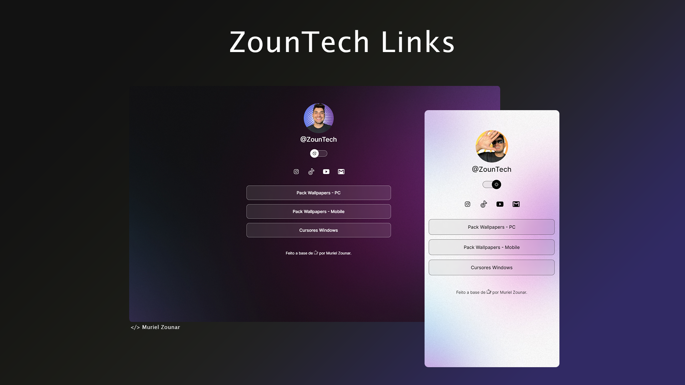

<h1 align="center"> ZounTech Links </h1>

  

## 🚀 Tecnologias

Esse projeto foi desenvolvido com as seguintes tecnologias:

- HTML e CSS
- JavaScript
- Git e Github
- Figma

## 💻 Projeto

O ZounTech Links é um agregador de links que utilizarei para armazenar os links que disponibilizo em minhas redes sociais (@zountech).

- [Acesse o projeto finalizado, online](https://murielzounar.github.io/ztlinks/)

## 🎓 Aprendizado

Este projeto foi desenvolvido acompanhando as aulas do treinamento Discover da Rocketseat.
Aprendi conceitos básicos de HTML, CSS e JavaScript, além de uma introdução ao Figma.

---

👌🏻 Conhecimento não ocupa espaço.
🚀 Never stop learning
